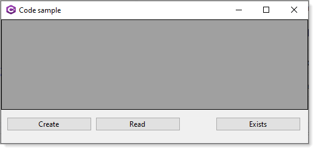
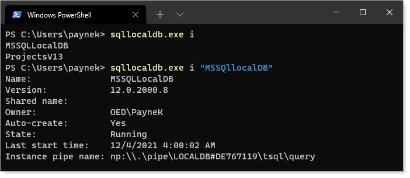

# Working with SQL-Server Express-LocalDb

This repository has code samples for working with SQL-Server [LocalDb](https://docs.microsoft.com/en-us/sql/database-engine/configure-windows/sql-server-express-localdb?view=sql-server-ver15) databases using C# 9 (or higher), .NET Core 5 (or higher). Each code sample will have a readme file explaining purpose and details on how to use plus any caveats.

Microsoft SQL Server Express LocalDB is a feature of SQL Server Express targeted to developers. 

> LocalDB is a special, low impact version of the SQL Server engine, that is not installed as a Windows Service, but launched (made to run) on demand by the ADO.NET client opening a connection to it. It is intended for single user scenarios, and not for any production use - for production you should use SQL Server Express (or higher)

[ErikEJ](http://erikej.blogspot.com/2011/01/comparison-of-sql-server-compact-4-and.html)

- **12/05/2021** Only one code sample, how to create a localDb in code. 
- **12/14/2021** Added code in LocalDbLibraryConsoleApp to create a LocalDb version of NorthWind database
- **12/14/2021** Added Entity Framework Core 5 class project which relies on LocalDbLibraryConsoleApp to first create the database.
 

| Project  | Description
| :--- | :--- |
| LocalDbLibrary | Code to create a localDb in code |
| NorthWindLibrary | Uses NorthWind database created in project LocalDbLibraryConsoleApp |
| LocalDbLibraryConsoleApp | Test project for LocalDbLibrary |

# Special note

Creating the database in the console app then attempting to in the windows form app or reverse will cause a runtime exception as the database can not be duplicated. So after running one of the projects and want to run the other detach/delete the first database which is easy in SSMS.

# Requires

- SQL Server Express [LocalDB](https://docs.microsoft.com/en-us/sql/database-engine/configure-windows/sql-server-express-localdb?view=sql-server-ver15) installed
- Visual Studio 2019 or higher
- In some cases proper permissions to SQL-Server
 
# Recommendations

Have [SSMS](https://docs.microsoft.com/en-us/sql/ssms/download-sql-server-management-studio-ssms?view=sql-server-ver15) (SQL-Server Management Studio) installed

#### See also

[SqlLocalDB Utility](https://docs.microsoft.com/en-us/sql/tools/sqllocaldb-utility?view=sql-server-ver15)

[Command-Line Management Tool: SqlLocalDB.exe](https://docs.microsoft.com/en-us/sql/relational-databases/express-localdb-instance-apis/command-line-management-tool-sqllocaldb-exe?view=sql-server-ver15)

SqlLocalDB.exe is a simple tool that enables the user to easily manage LocalDB instances from the command line. It is implemented as a simple wrapper around the LocalDB instance API. As in many similar SQL Server tools (for example, SQLCMD), parameters are passed to SqlLocalDB as command-line arguments and output is sent to the console.

Use the **SqlLocalDB utility** to create an instance of MicrosoftSQL Server 2016 Express **LocalDB**. The SqlLocalDB utility (SqlLocalDB.exe) is a simple command line tool to enable users and developers to create and manage an instance of SQL Server Express LocalDB. For information about how to use LocalDB.

[Create a SQL Server Database programmatically by using ADO.NET and Visual C# .NET](https://docs.microsoft.com/en-us/troubleshoot/dotnet/csharp/create-sql-server-database-programmatically)

This article describes how to create a SQL Server Database programmatically by using ADO.NET and Visual C# .NET. Which is from Microsoft which is good but lacks details and options found in LocalDbLibrary.Classes.[DataOperations](https://github.com/karenpayneoregon/localdb-samples/blob/master/LocalDbLibrary/Classes/DataOperations.cs)

[Creating a Connection String and Working with SQL Server LocalDB](https://docs.microsoft.com/en-us/aspnet/mvc/overview/getting-started/introduction/creating-a-connection-string)

# Version details

From a command prompt `sqllocaldb.exe i` to get instances on a machince then to get information for a speccific instance `sqllocaldb.exe i "MSSQllocalDB"`.

 

